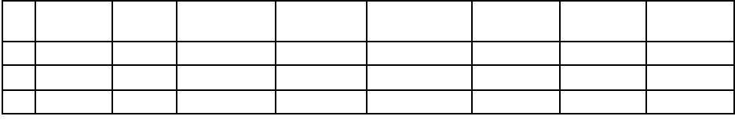

# Weapon/ Threat Detection in Video Conferencing

## Sample Prediction Results

.jpeg 'title A') | .jpeg 'title B')

## Background

The Corona Virus Disease (COVID-19) pandemic has forced many companies to adopt remote work policies. With traditional in-person meetings disrupted by lockdowns and travel restrictions, companies needed a way to ensure business continuity. Video conferencing allowed them to continue important discussions, negotiations, and decision-making processes without physical presence. The IT industry extensively relies on video conferencing technologies such as Zoom, Microsoft Teams, and Cisco Webex to facilitate team collaboration regardless of geographical location. These systems include capabilities like screen sharing, virtual whiteboards, and chat functions that improve communication and make it appear as if everyone is physically present.

Despite these benefits, video or chat conferencing platforms involve sensitive and confidential information, such as financial data, legal documents, and trade secrets. If this information falls into the wrong hands, it could result in significant financial and reputational damage to the organization.

The below section highlights some of the main challenges related to regulations and security that arise in the context of video conferencing:
  1. Sharing Confidential Information: During video conferences, participants often share their screens to present information. However, this practice raises concerns about unintentional exposure of sensitive and private data. If appropriate precautions are not taken to secure the shared content, companies may unknowingly violate data protection regulations such as GDPR or HIPAA.
  2. Displaying Forbidden Content: Video conferences may involve discussions touching on restricted or prohibited topics. Displaying such content, whether intentional or accidental, can result in regulatory violations or legal consequences.
  3. Inappropriate Conduct: In a virtual setting, participants might engage in inappropriate behavior such as offensive language, discriminatory comments, or harassment. Such conduct not only creates an unfavorable work environment but also exposes companies to potential legal action and damage to their reputation.
  4. Risk of Data Loss and Noncompliance: Accidentally sharing incorrect files or confidential information can lead to data loss and breaches of privacy. Insufficient security measures during video, voice, chat, or document sharing can result in both security breaches and noncompliance issues, especially if personal or sensitive data is compromised.

There is a critical need for sophisticated technologies that can efficiently analyze and monitor video, audio, and text recordings to address the challenges posed by the content shared through collaborative platforms such as video conferencing and chat collaboration tools. These tools, powered by state-of-the-art technologies such as deep learning, natural language processing, and object recognition and detection, play a vital role in monitoring conversations and videos. They can identify potential guideline violations. These analysis and supervision tools enable organizations to automatically identify inappropriate content, verify compliance with company policies, and deliver instant alerts.

## Objective
The goal of this task is to create a machine learning model that can accurately and efficiently detect weapons within images and videos in real-time, thereby enhancing the security and safety of virtual interactions.
 1. To design and train a model that could accurately recognize weapons, ensuring that any instance of such content is promptly flagged.
 2. Develop a real-time weapon detection model that can accurately identify the presence of weapons in images and videos during live video conferencing sessions.
 3. The model should be able to process the video feed in real-time and provide instantaneous alerts if a weapon is detected. 
 4. The model should detect commonly used hand weapons such as Pistols, Rifles, and Knives. 

## Dataset

The dataset Weapon Detection is obtained from GitHub and the dataset contains images of various weapon items such as Pistol, Rifles and Knives. https://github.com/ari-dasci/OD-WeaponDetection/tree/master. 

## Results

# Hyper Paramer Chosen

